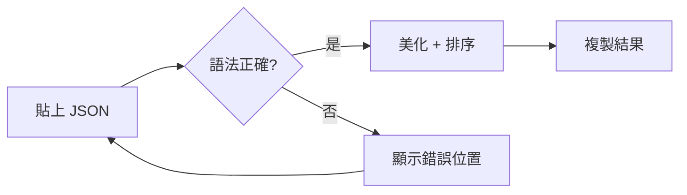
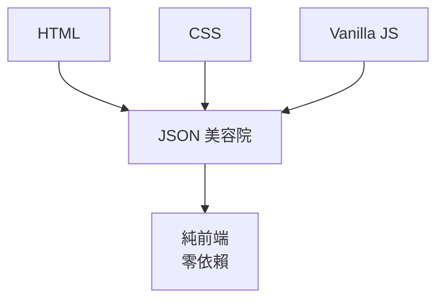

# JSON 美容院 | JSON Salon

> [← 回到 Muripo HQ](https://tznthou.github.io/muripo-hq/)

貼上亂糟糟的 JSON，得到漂亮整齊的 JSON。特別適合編輯 MCP 設定檔！

## 功能

- **即時美化** - 貼上 JSON 立即看到美化結果
- **Keys 排序** - 自動按字母排序所有 keys
- **語法檢查** - 錯誤時告訴你哪一行出問題
- **一鍵複製** - 複製美化後的結果

## 流程



## 快速開始

```bash
# 直接開啟
open index.html

# 或使用靜態伺服器
npx serve .
```

## 使用方式

1. 貼上 JSON 到左側輸入框
2. 右側自動顯示美化結果
3. 點擊「複製結果」或按 `Cmd/Ctrl + Enter`

## 快捷鍵

| 快捷鍵 | 功能 |
|--------|------|
| `Cmd/Ctrl + Enter` | 複製結果 |
| `Cmd/Ctrl + Shift + V` | 貼上並處理 |

## 選項

| 選項 | 說明 |
|------|------|
| 排序 Keys | 按字母順序排序所有物件的 keys |
| 縮排 | 2 spaces / 4 spaces / Tab |

## 成就系統

使用過程中可能解鎖：

| 成就 | 條件 |
|------|------|
| 美容初體驗 | 第一次成功美化 JSON |
| JSON 巨獸馴服師 | 美化超過 5000 字元的 JSON |
| MCP 設定大師 | 美化包含 `mcpServers` 的設定檔 |

## 技術棧



- 純原生 JavaScript，無框架依賴
- Clipboard API 處理複製貼上
- JSON.parse / JSON.stringify 處理美化

## License

[MIT](LICENSE)
