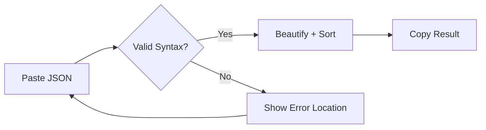
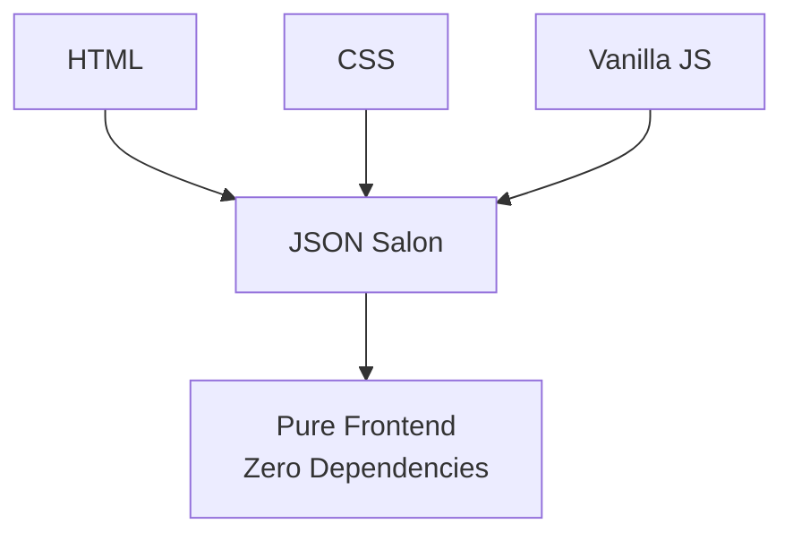

# JSON Salon

> [← Back to Muripo HQ](https://tznthou.github.io/muripo-hq/) | [中文](README.md)

Paste messy JSON, get beautifully formatted JSON. Especially useful for editing MCP configuration files!

## Features

- **Instant Beautification** - Paste JSON and see the formatted result immediately
- **Keys Sorting** - Automatically sort all keys alphabetically
- **Syntax Checking** - Shows which line has errors when JSON is invalid
- **One-Click Copy** - Copy the beautified result with a single click

## Flow



## Quick Start

```bash
# Open directly
open index.html

# Or use a static server
npx serve .
```

## Usage

1. Paste JSON into the left input box
2. The right side automatically shows the beautified result
3. Click "Copy Result" or press `Cmd/Ctrl + Enter`

## Keyboard Shortcuts

| Shortcut | Action |
|----------|--------|
| `Cmd/Ctrl + Enter` | Copy result |
| `Cmd/Ctrl + Shift + V` | Paste and process |

## Options

| Option | Description |
|--------|-------------|
| Sort Keys | Sort all object keys alphabetically |
| Indentation | 2 spaces / 4 spaces / Tab |

## Achievement System

You may unlock achievements during use:

| Achievement | Condition |
|-------------|-----------|
| First Beautification | Successfully beautify JSON for the first time |
| JSON Beast Tamer | Beautify JSON with more than 5000 characters |
| MCP Config Master | Beautify a config file containing `mcpServers` |

## Tech Stack



- Pure vanilla JavaScript, no framework dependencies
- Clipboard API for copy/paste handling
- JSON.parse / JSON.stringify for beautification

## License

[MIT](LICENSE)

---

## Author

Tzu-Chao - [tznthou@gmail.com](mailto:tznthou@gmail.com)
